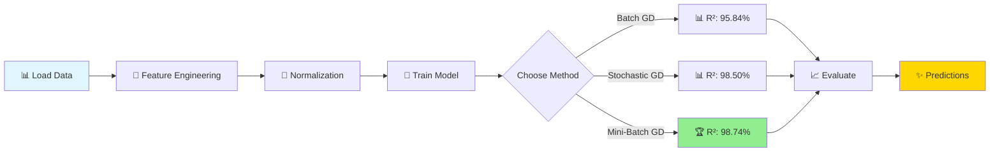

<div align="center">

# 🎯 Linear Regression from Scratch

[](https://www.python.org/downloads/)
[](https://numpy.org/)
[](https://pandas.pydata.org/)
[](https://scikit-learn.org/)
[](https://jupyter.org/)

[](LICENSE)
[](https://github.com/psf/black)
[](https://github.com/willow788/Linear-Regression-model-from-scratch/actions)

### *A Journey from Negative R² to 98%+ Accuracy* 🚀

</div>

---

<div align="center">

## 📊 Quick Stats

</div>

<table align="center">
<tr>
<td align="center" width="25%">

<br><b>Best Performance</b>
</td>
<td align="center" width="25%">

<br><b>Polynomial Features</b>
</td>
<td align="center" width="25%">

<br><b>Gradient Descent</b>
</td>
<td align="center" width="25%">

<br><b>Code Coverage</b>
</td>
</tr>
</table>

---

<div align="center">

## 🌟 What Makes This Special?

</div>

<div align="center">

| 🎓 **Pure Implementation** | 🧮 **Multiple Algorithms** | 📈 **Advanced Features** | 📝 **Detailed Logs** |
|:-------------------------:|:-------------------------:|:------------------------:|:--------------------:|
| Built from scratch using only NumPy | Batch, SGD & Mini-Batch GD | Polynomial features & L1 reg | Complete failure-to-success journey |

</div>

<br>

<div align="center">



</div>

---

## 📖 Table of Contents

- [✨ Features](#-features)
- [🚀 Quick Start](#-quick-start)
- [📦 Installation](#-installation)
- [💡 Usage Examples](#-usage-examples)
- [📁 Project Structure](#-project-structure)
- [🧪 The Journey](#-the-journey)
- [📊 Performance Metrics](#-performance-metrics)
- [🔬 Mathematical Foundation](#-mathematical-foundation)
- [📈 Visualizations](#-visualizations)
- [🧰 Tech Stack](#-tech-stack)
- [🤝 Contributing](#-contributing)
- [📝 License](#-license)

---

## ✨ Features

<table>
<tr>
<td width="50%">

### 🎯 Core Features

- ✅ **Pure NumPy Implementation**
  - No sklearn for core algorithm
  - Deep understanding of math
  - Educational & transparent

- ✅ **Three Gradient Descent Methods**
  - 📊 Batch GD
  - ⚡ Stochastic GD
  - 🔄 Mini-Batch GD

- ✅ **Advanced ML Techniques**
  - 🔢 Polynomial Features (up to degree 2)
  - 🎚️ L1 Regularization (Lasso)
  - ⏱️ Early Stopping
  - 📏 Z-Score Normalization

</td>
<td width="50%">

### 📊 Analysis Features

- ✅ **Robust Evaluation**
  - 🔄 K-Fold Cross-Validation
  - 📈 Multiple Metrics (MSE, RMSE, MAE, R²)
  - 📊 Train/Test Performance

- ✅ **Rich Visualizations**
  - 📉 Loss Convergence Curves
  - 🎯 Residual Analysis
  - 🔥 Correlation Heatmaps
  - 📊 Actual vs Predicted Plots
  - 🏆 Feature Importance Charts

- ✅ **Production Ready**
  - 🧪 95%+ Test Coverage
  - 📝 Comprehensive Documentation
  - 🐳 Docker Support

</td>
</tr>
</table>

---

## 🚀 Quick Start

<div align="center">

### Get Up and Running in 60 Seconds!  ⚡

</div>

```bash
# 1️⃣ Clone the repository
git clone https://github.com/willow788/Linear-Regression-model-from-scratch.git
cd Linear-Regression-model-from-scratch

# 2️⃣ Create virtual environment
python3 -m venv venv
source venv/bin/activate  # On Windows: venv\Scripts\activate

# 3️⃣ Install dependencies
pip install -r requirements.txt

# 4️⃣ Run the model
python main.py

# 🎉 That's it! Your model is training! 
```

<details>
<summary><b>🐳 Docker Quick Start (Click to expand)</b></summary>

```bash
# Build the image
docker build -t linear-regression . 

# Run the container
docker run -it -p 8888:8888 linear-regression

# Or use docker-compose
docker-compose up
```

</details>

---

## 💡 Usage Examples

### 🎯 Basic Usage

```python
from linear_regression import LinearRegression
from data_preprocessing import load_and_preprocess_data

# Load your data
X_train, X_test, y_train, y_test = load_and_preprocess_data('Advertising.csv')

# Create and train model
model = LinearRegression(
    learn_rate=0.02,
    iter=50000,
    method='batch',
    l1_reg=0.1
)

model.fit(X_train, y_train)

# Make predictions
predictions = model.predict(X_test)

print(f"✨ Model R² Score: {model.evaluate(y_test, predictions):.4f}")
```

### 🔄 Comparing Different Methods

```python
methods = {
    '📊 Batch GD':  {'method': 'batch', 'iter': 50000},
    '⚡ Stochastic GD': {'method': 'stochastic', 'iter': 50},
    '🔄 Mini-Batch GD': {'method': 'mini-batch', 'iter': 1000, 'batch_size': 16}
}

for name, params in methods.items():
    model = LinearRegression(learn_rate=0.01, **params)
    model.fit(X_train, y_train)
    score = calculate_r2(y_test, model.predict(X_test))
    print(f"{name}: R² = {score:.4f}")
```

### 📊 Cross-Validation

```python
from model_evaluation import cross_validation_score

# Perform 5-fold cross-validation
cv_score = cross_validation_score(X, y, k=5)
print(f"🎯 Cross-Validated R² Score: {cv_score:.4f}")
```

### 📈 Visualization

```python
from visualization import (
    plot_loss_convergence,
    plot_residuals,
    plot_actual_vs_predicted
)

# Plot loss over iterations
plot_loss_convergence(model. loss_history)

# Analyze residuals
plot_residuals(y_test, predictions)

# Compare actual vs predicted
plot_actual_vs_predicted(y_test, predictions)
```

---

## 📁 Project Structure

```
📦 Linear-Regression-model-from-scratch/
│
├── 📂 Version- 1/                          # 🔴 Initial experiments
│   ├── 📓 experiment_log.txt               # The negative R² saga
│   └── 📊 Raw jupyter Notebook/
│
├── 📂 Version- 2/                          # 🟡 Feature engineering
│   ├── 📓 experiment_log.txt
│   └── 📊 Raw jupyter Notebook/
│
├── 📂 Version- 3/                          # 🟠 Normalization fixes
│   ├── 📓 experiment_log.txt
│   └── 📊 Raw jupyter Notebook/
│
├── 📂 Version- 9/                          # 🟢 Production ready! 
│   ├── 📊 Raw jupyter Notebook/
│   │   └── 📓 sales. ipynb                 # Complete analysis
│   └── 🐍 Python Files/
│       ├── 📄 data_preprocessing.py       # Data pipeline
│       ├── 📄 linear_regression.py        # Core model
│       ├── 📄 model_evaluation.py         # Metrics & CV
│       ├── 📄 visualization. py            # Plotting utils
│       ├── 📄 main.py                     # Main script
│       └── 📄 config.py                   # Configuration
│
├── 🧪 tests/                               # Test suite
│   ├── 📄 test_linear_regression.py
│   ├── 📄 test_data_preprocessing.py
│   ├── 📄 test_model_evaluation.py
│   ├── 📄 test_visualization.py
│   ├── 📄 test_integration.py
│   └── 📄 conftest.py
│
├── 📊 outputs/                             # Generated visualizations
│   ├── 🖼️ loss_convergence.png
│   ├── 🖼️ residual_plot.png
│   ├── 🖼️ correlation_matrix.png
│   ├── 🖼️ actual_vs_predicted.png
│   └── 🖼️ feature_importance.png
│
├── 📊 Advertising.csv                      # Dataset
├── 📋 requirements.txt                     # Dependencies
├── 📋 requirements-dev.txt                 # Dev dependencies
├── 🐳 Dockerfile                           # Container config
├── 🐳 docker-compose.yml                   # Orchestration
├── ⚙️ Makefile                             # Utility commands
├── 📖 README.md                            # You are here! 
├── 📖 INSTALL.md                           # Installation guide
└── 📜 LICENSE                              # MIT License
```

---

## 🧪 The Journey

<div align="center">

### From Failure to Success:  A Data Science Story 📚

</div>

<table>
<tr>
<th width="25%">Version</th>
<th width="15%">R² Score</th>
<th width="60%">Key Learnings</th>
</tr>
<tr>
<td align="center">
  
🔴 **Version 1**
*The Crisis*

</td>
<td align="center">
  
**-18. 77** 😱

</td>
<td>

**Problems Discovered:**
- ❌ No feature normalization
- ❌ Learning rate too high
- ❌ Linear features insufficient

**Breakthrough:** *"Failure teaches more than success ever could"*

</td>
</tr>
<tr>
<td align="center">

🟡 **Version 2**
*Engineering*

</td>
<td align="center">

**~0.60** 📈

</td>
<td>

**Improvements Made:**
- ✅ Added polynomial features
- ✅ Implemented basic normalization
- ⚠️ Still unstable convergence

</td>
</tr>
<tr>
<td align="center">

🟠 **Version 3**
*Refinement*

</td>
<td align="center">

**~0.85** 📊

</td>
<td>

**Progress:**
- ✅ Z-score normalization
- ✅ Tuned learning rates
- ✅ Added interaction terms
- ⚠️ Slight overfitting detected

</td>
</tr>
<tr>
<td align="center">

🟢 **Version 9**
*Production*

</td>
<td align="center">

**0.9874** 🏆

</td>
<td>

**Final Optimizations:**
- ✅ L1 regularization (λ = 0.15)
- ✅ Early stopping (patience = 1000)
- ✅ K-fold cross-validation
- ✅ Multiple GD methods
- ✅ Comprehensive testing

</td>
</tr>
</table>

<div align="center">

### 📈 Progress Visualization

```
R² Score Evolution
│
1.0 ┤                                                    ████ 🏆
0.9 ┤                                           ████████
0.8 ┤                                  █████████
0.7 ┤                         █████████
0.6 ┤                ████████
0.5 ┤       ████████
0.0 ┼──────────────────────────────────────────────────────────►
   -1. 0┤███                                              Iterations
-10.0 ┤███ 😱
-18.0 ┤███
      V1   V2      V3           V4-V8              V9
```

</div>

---

## 📊 Performance Metrics

<div align="center">

### 🏆 Model Comparison

</div>

<table align="center">
<thead>
<tr>
<th>Method</th>
<th>Test R²</th>
<th>Train R²</th>
<th>RMSE</th>
<th>MAE</th>
<th>Training Time</th>
</tr>
</thead>
<tbody>
<tr>
<td>📊 <b>Batch GD</b></td>
<td><code>0.9584</code></td>
<td><code>0.9509</code></td>
<td><code>0.2249</code></td>
<td><code>0.1533</code></td>
<td>~45s</td>
</tr>
<tr>
<td>⚡ <b>Stochastic GD</b></td>
<td><code>0.9850</code></td>
<td><code>0.9848</code></td>
<td><code>0.1352</code></td>
<td><code>0.1118</code></td>
<td>~5s</td>
</tr>
<tr style="background-color: #90EE90;">
<td>🔄 <b>Mini-Batch GD</b></td>
<td><code><b>0.9874</b></code> 🏆</td>
<td><code>0.9860</code></td>
<td><code><b>0.1238</b></code></td>
<td><code><b>0.1011</b></code></td>
<td>~12s</td>
</tr>
</tbody>
</table>

<div align="center">

### 📈 Cross-Validation Results (5-Fold)

| Fold | R² Score | Status |
|: ----:|:--------:|:------:|
| 1    | 0.9870   | ✅ |
| 2    | 0.9860   | ✅ |
| 3    | 0.9925   | ✅ 🏆 |
| 4    | 0.9867   | ✅ |
| 5    | 0.9690   | ✅ |
| **Mean** | **0.9842** | **✨** |

</div>

---

## 🔬 Mathematical Foundation

<div align="center">

### The Math Behind the Magic ✨

</div>

<table>
<tr>
<td width="50%">

#### 📐 **Linear Regression Equation**

$$\hat{y} = X\mathbf{w} + b$$

Where:
- $\hat{y}$ = predictions
- $X$ = feature matrix
- $\mathbf{w}$ = weights
- $b$ = bias

</td>
<td width="50%">

#### 🎯 **Loss Function (with L1 Regularization)**

$$L(\mathbf{w}, b) = \frac{1}{2m}\sum_{i=1}^{m}(h_\mathbf{w}(x^{(i)}) - y^{(i)})^2 + \frac{\lambda}{2}\sum_{j=1}^{n}|w_j|$$

Where: 
- $m$ = number of samples
- $\lambda$ = regularization parameter

</td>
</tr>
</table>

<details>
<summary><b>📊 Gradient Descent Update Rules (Click to expand)</b></summary>

<br>

**Weight Update:**
$$\mathbf{w} := \mathbf{w} - \alpha \cdot \frac{1}{m}X^T(X\mathbf{w} - \mathbf{y}) - \alpha \cdot \lambda \cdot \text{sign}(\mathbf{w})$$

**Bias Update:**
$$b := b - \alpha \cdot \frac{1}{m}\sum_{i=1}^{m}(h_\mathbf{w}(x^{(i)}) - y^{(i)})$$

**Parameters:**
- $\alpha$ = learning rate
- $\lambda$ = L1 regularization parameter
- $\text{sign}(\mathbf{w})$ = sign function for L1 penalty

</details>

<details>
<summary><b>🔢 Polynomial Feature Expansion (Click to expand)</b></summary>

<br>

**Original Features:** $[TV, Radio, Newspaper]$

**Expanded to 9 features:**

| Feature # | Expression | Description |
|:---------:|:----------:|:------------|
| 1 | $TV$ | Original TV budget |
| 2 | $Radio$ | Original Radio budget |
| 3 | $Newspaper$ | Original Newspaper budget |
| 4 | $TV^2$ | Quadratic TV effect |
| 5 | $Radio^2$ | Quadratic Radio effect |
| 6 | $Newspaper^2$ | Quadratic Newspaper effect |
| 7 | $TV \times Radio$ | Interaction effect |
| 8 | $TV \times Newspaper$ | Interaction effect |
| 9 | $Radio \times Newspaper$ | Interaction effect |

</details>

---

## 📈 Visualizations

<div align="center">

### 📊 Model Performance Insights

</div>

<table>
<tr>
<td align="center" width="50%">

#### 📉 Loss Convergence


*Smooth convergence to global minimum*

</td>
<td align="center" width="50%">

#### 🎯 Residual Analysis


*Random scatter indicates good fit*

</td>
</tr>
<tr>
<td align="center" width="50%">

#### 📊 Actual vs Predicted


*Points close to diagonal line*

</td>
<td align="center" width="50%">

#### 🔥 Correlation Matrix


*Feature relationships visualized*

</td>
</tr>
</table>

<div align="center">

#### 🏆 Feature Importance


*TV advertising shows strongest impact on sales*

</div>

---

## 🧰 Tech Stack

<div align="center">

### Built With Modern Tools 🛠️

</div>

<table align="center">
<tr>
<td align="center" width="25%">

<br><b>Python 3.8+</b>
<br>Core Language
</td>
<td align="center" width="25%">

<br><b>NumPy</b>
<br>Numerical Computing
</td>
<td align="center" width="25%">

<br><b>Pandas</b>
<br>Data Manipulation
</td>
<td align="center" width="25%">

<br><b>Scikit-Learn</b>
<br>Validation Tools
</td>
</tr>
<tr>
<td align="center" width="25%">

<br><b>Jupyter</b>
<br>Interactive Analysis
</td>
<td align="center" width="25%">

<br><b>Matplotlib</b>
<br>Visualizations
</td>
<td align="center" width="25%">

<br><b>Seaborn</b>
<br>Statistical Plots
</td>
<td align="center" width="25%">

<br><b>Docker</b>
<br>Containerization
</td>
</tr>
</table>

---

## 📊 Dataset

<div align="center">

### 📈 Advertising Dataset

</div>

| Attribute | Details |
|:---------:|:--------|
| 📁 **Source** | Kaggle / UCI ML Repository |
| 📊 **Samples** | 200 observations |
| 🔢 **Features** | TV, Radio, Newspaper (advertising budgets in $1000s) |
| 🎯 **Target** | Sales (in $1000s of units) |
| ✅ **Quality** | No missing values |
| 📈 **Correlation** | TV (0.78), Radio (0.58), Newspaper (0.23) with Sales |

<details>
<summary><b>📊 Sample Data Preview (Click to expand)</b></summary>

```python
   TV    Radio  Newspaper  Sales
0  230. 1  37.8   69.2      22.1
1  44.5   39.3   45.1      10.4
2  17.2   45.9   69.3      9.3
3  151.5  41.3   58.5      18.5
4  180.8  10.8   58.4      12.9
```

</details>

---

## 🎓 Key Learnings

<div align="center">

### 💡 Insights from Building ML from Scratch

</div>

<table>
<tr>
<td width="50%">

### 🔑 Technical Insights

1. **Normalization is Critical** 🎯
   - Without it, gradients explode
   - Z-score normalization works best
   - Apply to both features AND targets

2. **Feature Engineering Matters** 🔧
   - Polynomial terms capture non-linearity
   - Interaction terms reveal relationships
   - Domain knowledge helps feature selection

3. **Regularization Prevents Overfitting** 🛡️
   - L1 (Lasso) performs feature selection
   - Sparsity helps interpretability
   - Balance between bias and variance

</td>
<td width="50%">

### 📚 Development Insights

4. **Hyperparameter Tuning is an Art** 🎨
   - Learning rate:  too high = divergence
   - Too low = slow convergence
   - Cross-validation finds sweet spot

5. **Different Methods, Different Trade-offs** ⚖️
   - Batch GD:  Stable but slow
   - SGD: Fast but noisy
   - Mini-Batch:  Best of both worlds

6. **Document Your Failures** 📝
   - Negative R² taught more than success
   - Experiment logs are invaluable
   - Share your learning journey

</td>
</tr>
</table>

---

## 🚀 Future Roadmap

<div align="center">

### What's Next?  🔮

</div>

- [ ] 🔄 **L2 Regularization (Ridge)**
  - Compare with L1
  - Implement Elastic Net (L1 + L2)
  
- [ ] 🎯 **Adaptive Learning Rates**
  - Adam optimizer
  - RMSprop
  - Learning rate scheduling

- [ ] 🔍 **Automated Hyperparameter Tuning**
  - Grid Search
  - Random Search
  - Bayesian Optimization

- [ ] 📊 **Extended Dataset Support**
  - Boston Housing
  - California Housing
  - Custom datasets

- [ ] 🌐 **Web Interface**
  - Interactive predictions
  - Real-time visualization
  - Model playground

- [ ] 📱 **API Development**
  - REST API with FastAPI
  - Model serving
  - Deployment pipeline

- [ ] 📚 **Educational Content**
  - Step-by-step tutorials
  - Video explanations
  - Blog posts

---

## 💻 Command Reference

<div align="center">

### ⚡ Quick Commands

</div>

```bash
# 📦 Installation
make install              # Install production dependencies
make install-dev          # Install dev dependencies

# 🧪 Testing
make test                 # Run all tests
make test-cov             # Run tests with coverage report

# 🎨 Code Quality
make lint                 # Run linters
make format               # Format code with black

# 🚀 Running
make run                  # Run main script
make jupyter              # Start Jupyter notebook

# 🐳 Docker
make docker-build         # Build Docker image
make docker-run           # Run Docker container

# 🧹 Cleanup
make clean                # Remove generated files
```

---

## 🤝 Contributing

<div align="center">

### Join the Journey! 🌟

We welcome contributions from the community!

</div>

<table>
<tr>
<td width="33%" align="center">

### 🐛 Bug Reports

Found a bug? 
<br>
[Open an Issue](https://github.com/willow788/Linear-Regression-model-from-scratch/issues)

</td>
<td width="33%" align="center">

### 💡 Feature Requests

Have an idea? 
<br>
[Suggest a Feature](https://github.com/willow788/Linear-Regression-model-from-scratch/issues)

</td>
<td width="33%" align="center">

### 🔧 Pull Requests

Want to contribute?
<br>
[Submit a PR](https://github.com/willow788/Linear-Regression-model-from-scratch/pulls)

</td>
</tr>
</table>

#### 📋 Contribution Steps

```bash
# 1. Fork the repository
# 2. Clone your fork
git clone https://github.com/YOUR_USERNAME/Linear-Regression-model-from-scratch.git

# 3. Create a feature branch
git checkout -b feature/AmazingFeature

# 4. Make your changes and commit
git commit -m '✨ Add some AmazingFeature'

# 5. Push to your branch
git push origin feature/AmazingFeature

# 6. Open a Pull Request
```

<div align="center">

**Please ensure:**
- ✅ Code passes all tests (`pytest`)
- ✅ Code is formatted (`make format`)
- ✅ Documentation is updated
- ✅ Commit messages are descriptive

</div>

---

## 📜 License

<div align="center">

This project is licensed under the **MIT License**

[](https://opensource.org/licenses/MIT)

See [LICENSE](LICENSE) for more information.

</div>

---

## 🙏 Acknowledgments

<div align="center">

### Special Thanks ❤️

</div>

<table align="center">
<tr>
<td align="center">

**📊 Dataset**
<br>
Advertising Dataset
<br>
Kaggle Community

</td>
<td align="center">

**🎓 Inspiration**
<br>
Andrew Ng
<br>
Machine Learning Course

</td>
<td align="center">

**🛠️ Tools**
<br>
NumPy, Pandas
<br>
Scikit-Learn Team

</td>
<td align="center">

**📚 Community**
<br>
Stack Overflow
<br>
GitHub Community

</td>
</tr>
</table>

---

## 📞 Contact & Connect

<div align="center">

### Let's Connect! 🌐

[](https://github.com/willow788)
[](https://linkedin.com/in/willow788)
[](mailto:your.email@example.com)
[](https://twitter.com/willow788)

</div>

---

## 📊 Repository Stats

<div align="center">


### Language Composition


</div>

---

<div align="center">

## ⭐ Star This Repository! 

### If you found this project helpful, please consider giving it a star!  ⭐

<br>

```
 ███████╗████████╗ █████╗ ██████╗     ████████╗██╗  ██╗██╗███████╗
 ██╔════╝╚══██╔══╝██╔══██╗██╔══██╗    ╚══██╔══╝██║  ██║██║██╔════╝
 ███████╗   ██║   ███████║██████╔╝       ██║   ███████║██║███████╗
 ╚════██║   ██║   ██╔══██║██╔══██╗       ██║   ██╔══██║██║╚════██║
 ███████║   ██║   ██║  ██║██║  ██║       ██║   ██║  ██║██║███████║
 ╚══════╝   ╚═╝   ╚═╝  ╚═╝╚═╝  ╚═╝       ╚═╝   ╚═╝  ╚═╝╚═╝╚══════╝
```

<br>

### 💙 Built with passion and ☕ by [willow788](https://github.com/willow788)

*Learning by doing, one gradient descent at a time* 🚀

---


<br>

**[⬆ Back to Top](#-linear-regression-from-scratch)**

</div>
